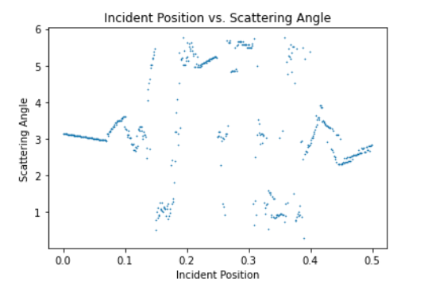

# Scattering
This respository includes the simulation of classical chaotic scattering, specifically the Gaspard-Rice system and Rutherford scattering. 
## Introduction
Classical chaotic scattering is a type of scattering where no quantum effect is involved, and the system shows strong sensitivity to initial condition. The setup of  Gaspard-Rice system includes a point particle colliding elastically with three hard disks arranged in the shape of an equilateral triangle. Rutherford scattering entails scattering between charged particles. 
## Installation
The programming language is python. The simulation requires the installation of VPython.
## Procedure

## Results
The following shows the simulation of Gaspard Rice scattering

## Discussion

