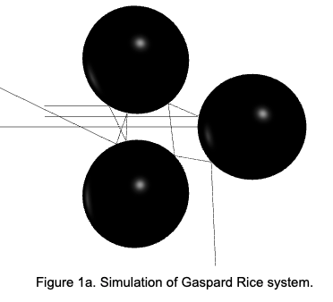
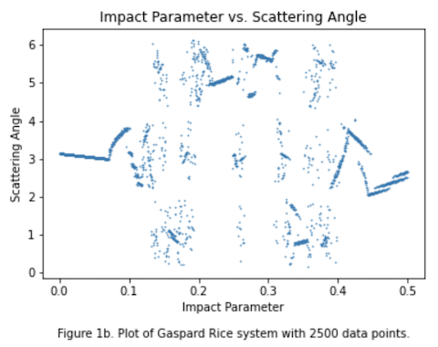
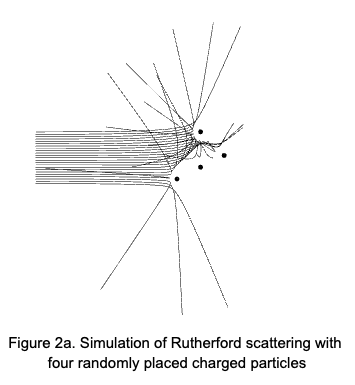
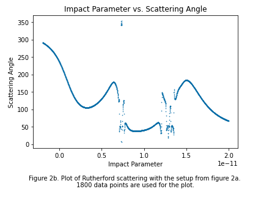

# Scattering
This respository includes the simulation of classical chaotic scattering, specifically the Gaspard-Rice system and Rutherford scattering. 
## Introduction
Classical chaotic scattering is a type of scattering where no quantum effect is involved, and the system shows strong sensitivity to initial condition. The setup of  Gaspard-Rice system includes a point particle colliding elastically with three hard disks arranged in the shape of an equilateral triangle. Rutherford scattering entails scattering between charged particles. 
## Installation
The programming language is python. The simulation requires the installation of VPython.
## Procedure

## Results

## Discussion

## Citation
[1]: https://aip.scitation.org/doi/pdf/10.1063/1.168549
[2]: https://dournac.org/info/chaotic_scattering

